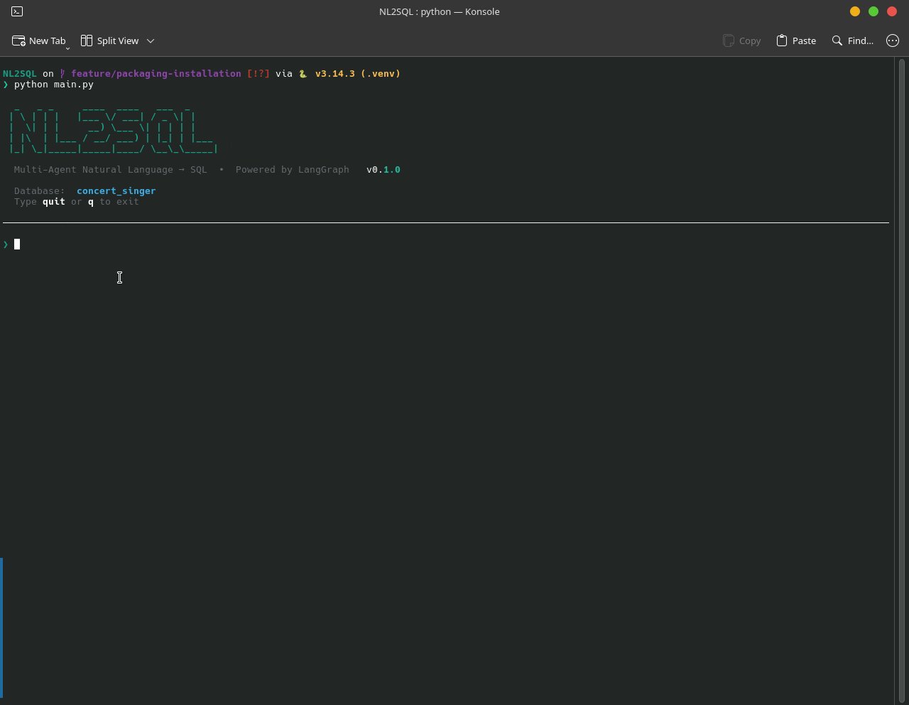
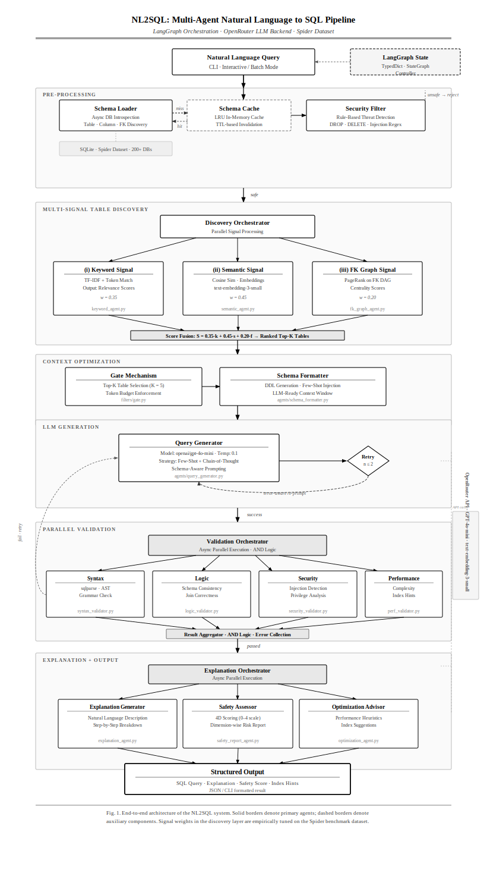

<div align="center">

# NL2SQL - Multi-Agent Natural Language to SQL System

[](https://www.python.org/downloads/)
[](https://langchain-ai.github.io/langgraph/)
[](https://pypi.org/project/nl2sql-agents/)
[](LICENSE)
[](https://github.com/psf/black)

A sophisticated **multi-agent orchestration system** that converts natural language queries into safe, optimized SQL using LangGraph and OpenRouter LLMs. Built with security, performance, and explainability at its core.



</div>

---

## Key Features

- **Multi-Agent Architecture**: 8 specialized agents working in harmony (Discovery, Security, Schema Formatting, Query Generation, Validation, Explanation)
- **Security-First**: Built-in SQL injection prevention, dangerous operation filtering, and security scoring
- **Smart Table Discovery**: Multi-signal ranking (keyword matching, semantic search, foreign key graph analysis)
- **Performance Validation**: Query optimization checks and performance score reporting
- **Explainability**: Human-readable explanations for every generated query
- **Async Architecture**: Non-blocking operations throughout the pipeline
- **Schema Caching**: Intelligent caching to reduce database introspection overhead
- **Comprehensive Logging**: Detailed file-based logging for debugging and monitoring

---

## Architecture

<div align="center">



<!-- <sub><i>Figure 1: End-to-end pipeline architecture — LangGraph-orchestrated multi-agent system with parallel signal discovery, N-candidate generation, 4-stage validation, and explainable output.</i></sub> -->

</div>

## Quick Start

### Prerequisites

- Python 3.13 or higher
- OpenRouter API key (or compatible LLM provider)
- SQLite databases (Spider dataset recommended)

### Installation & Usage (PyPI)

Install the package from [PyPI](https://pypi.org/project/nl2sql-agents/):

```bash
pip install nl2sql-agents
```

#### 1. Configure Environment Variables

After installing, create a `.env` file in your working directory (or export the variables in your shell):

```bash
# LLM Provider Configuration (required)
OPENAI_API_KEY=sk-or-v1-your-openrouter-api-key
OPENAI_BASE_URL=https://openrouter.ai/api/v1
OPENAI_MODEL=openai/gpt-4o-mini
OPENAI_EMBEDDING_MODEL=openai/text-embedding-3-small

# Database Configuration (required)
DB_TYPE=sqlite
DB_PATH=/absolute/path/to/your/database.sqlite
```

> **Note:** Any OpenAI-compatible API provider works — just set the base URL and API key accordingly.

#### 2. Point to Your SQLite Database

Set `DB_PATH` to the **absolute path** of any SQLite database you want to query:

```bash
# Example: your own database
DB_PATH=/home/user/data/sales.sqlite

# Example: Spider benchmark dataset
DB_PATH=/home/user/spider/database/concert_singer/concert_singer.sqlite
```

#### 3. Run the CLI

The `nl2sql` command is available globally after installation:

```bash
# Interactive REPL mode
nl2sql

# One-shot query
nl2sql "Show me all singers from France"

# Override the database path on the fly
nl2sql --db /path/to/other.sqlite "List all employees"

# Check version
nl2sql --version
```

#### Minimal Example

```bash
pip install nl2sql-agents

export OPENAI_API_KEY="sk-or-v1-your-key"
export OPENAI_BASE_URL="https://openrouter.ai/api/v1"
export OPENAI_MODEL="openai/gpt-4o-mini"
export OPENAI_EMBEDDING_MODEL="openai/text-embedding-3-small"
export DB_TYPE="sqlite"
export DB_PATH="/path/to/your/database.sqlite"

nl2sql "What are the top 5 products by revenue?"
```

---

### Install from Source (Development)

<details>
<summary>Click to expand source installation steps</summary>

1. **Clone the repository**
   ```bash
   git clone https://github.com/ToheedAsghar/NL2SQL.git
   cd NL2SQL
   ```

2. **Create virtual environment**
   ```bash
   python -m venv .venv
   source .venv/bin/activate  # On Windows: .venv\Scripts\activate
   ```

3. **Install dependencies**
   ```bash
   pip install -r requirements.txt
   ```

4. **Download Spider dataset** *(optional — for benchmarking)*
   
   The Spider dataset (877MB) is not included in the repository. Download it from the official source:
   
   ```bash
   # Visit https://yale-lily.github.io/spider
   # Download and extract to ./spider/ directory
   
   # Verify structure
   ls spider/database/
   # Should show: academic, concert_singer, car_1, etc.
   ```

5. **Configure environment**
   
   Create a `.env` file in the project root:
   
   ```bash
   # LLM Provider Configuration
   OPENAI_API_KEY=sk-or-v1-your-openrouter-api-key
   OPENAI_BASE_URL=https://openrouter.ai/api/v1
   OPENAI_MODEL=openai/gpt-4o-mini
   OPENAI_EMBEDDING_MODEL=openai/text-embedding-3-small
   
   # Database Configuration
   DB_TYPE=sqlite
   DB_PATH=./spider/database/concert_singer/concert_singer.sqlite
   
   # Optional: Adjust discovery agent weights
   # KEYWORD_WEIGHT=0.35
   # SEMANTIC_WEIGHT=0.45
   # FK_GRAPH_WEIGHT=0.20
   ```

6. **Run the application**
   ```bash
   python main.py
   ```

</details>

---

##  Usage Examples

### Interactive Mode (CLI)

```bash
nl2sql
```

```
Enter your question (or 'quit'/'exit'/'q'): 
> Show me all singers from France

══════════════════════════════════════════════════════════════
 SQL QUERY
══════════════════════════════════════════════════════════════
SELECT s.*
FROM concert_singer.singer AS s
WHERE s.Country = 'France'

══════════════════════════════════════════════════════════════
 EXPLANATION
══════════════════════════════════════════════════════════════
This query retrieves all singers from France by:
1. Selecting all columns from the singer table
2. Filtering records where Country equals 'France'
3. Using table alias 's' for readability

Safety Score: 3.5/4.0
✓ Security: Safe (no SQL injection risks)
✓ Syntax: Valid SQL
✓ Logic: Correct table and column usage
⚠ Performance: Consider adding index on Country column for large datasets

══════════════════════════════════════════════════════════════
```

### Sample Questions (Concert Singer Database)

```
- Show me all singers from France
- List all concerts held in 2024
- What are the top 5 stadiums by capacity?
- How many concerts did each singer perform?
- Which stadium hosted the most concerts?
- Find singers who have never performed in a concert
- Show me concerts with ticket prices above $100
```

---

## Configuration

### LLM Provider

The system uses OpenRouter by default, but you can configure any OpenAI-compatible API:

```env
OPENAI_API_KEY=your-api-key
OPENAI_BASE_URL=https://api.openai.com/v1  # or your provider
OPENAI_MODEL=gpt-4-turbo
OPENAI_EMBEDDING_MODEL=text-embedding-3-small
```

### Database Configuration

Switch between different databases by updating `DB_PATH`:

```env
# Concert Singer (music industry)
DB_PATH=./spider/database/concert_singer/concert_singer.sqlite

# Academic (papers and conferences)
DB_PATH=./spider/database/academic/academic.sqlite

# Car Sales
DB_PATH=./spider/database/car_1/car_1.sqlite
```

### Discovery Agent Tuning

Adjust table discovery signal weights in `.env`:

```env
KEYWORD_WEIGHT=0.35    # Exact keyword matching
SEMANTIC_WEIGHT=0.45   # Semantic similarity
FK_GRAPH_WEIGHT=0.20   # Foreign key relationships
```

---

## Project Structure

```
NL2SQL/
├── nl2sql_agents/                     # Installable Python package
│   ├── __init__.py                    # Package version & metadata
│   ├── cli.py                         # Rich CLI entry point
│   ├── py.typed                       # PEP 561 typed marker
│   ├── agents/                        # Agent modules
│   │   ├── __init__.py
│   │   ├── base_agent.py              # Base agent with LLM calling
│   │   ├── query_generator.py         # SQL generation agent
│   │   ├── schema_formatter.py        # Schema formatting agent
│   │   ├── discovery/                 # Table discovery agents
│   │   │   ├── __init__.py
│   │   │   ├── discovery_agent.py     # Multi-signal orchestrator
│   │   │   ├── keyword_agent.py       # Keyword matching
│   │   │   ├── semantic_agent.py      # Embedding-based search
│   │   │   └── fk_graph_agent.py      # Foreign key analysis
│   │   ├── validator/                 # Validation agents
│   │   │   ├── __init__.py
│   │   │   ├── validator_agent.py     # Orchestrator
│   │   │   ├── syntax_validator.py    # SQL syntax check
│   │   │   ├── logic_validator.py     # Logical correctness
│   │   │   ├── security_validator.py  # SQL injection check
│   │   │   └── performance_validator.py # Performance analysis
│   │   └── explainer/                 # Explanation agents
│   │       ├── __init__.py
│   │       ├── explainer_agent.py     # Orchestrator
│   │       ├── explanation_agent.py   # Query explanation
│   │       ├── safety_report_agent.py # Safety scoring
│   │       └── optimization_agent.py  # Optimization tips
│   ├── orchestrator/                  # LangGraph pipeline
│   │   ├── __init__.py
│   │   ├── pipeline.py                # Main graph definition
│   │   └── nodes.py                   # Node implementations
│   ├── filters/                       # Pre-processing filters
│   │   ├── __init__.py
│   │   ├── gate.py                    # Table gating
│   │   └── security_filter.py         # Query security filter
│   ├── db/                            # Database layer
│   │   ├── __init__.py
│   │   └── connector.py               # Async SQLite connector
│   ├── cache/                         # Caching layer
│   │   ├── __init__.py
│   │   └── schema_cache.py            # Schema caching
│   ├── config/                        # Configuration
│   │   ├── __init__.py
│   │   └── settings.py                # LLM provider settings
│   └── models/                        # Data models
│       ├── __init__.py
│       └── schemas.py                 # GraphState and schemas
├── data/                              # Local data assets
│   └── spider/
│       └── database/                  # Spider dataset databases
├── Assets/                            # Static assets
│   ├── architecture.svg
│   ├── nl2sql.gif                     # Demo GIF
│   └── nl2sql-architecture.svg        # Architecture diagram
├── logs/                              # Application logs (auto-created)
│   └── *.log                          # Timestamped log files
├── spider/                            # Spider benchmark files
│   ├── dev.json
│   ├── dev_gold.sql
│   ├── tables.json
│   ├── train_gold.sql
│   ├── train_others.json
│   ├── train_spider.json
│   ├── README.txt
│   └── database/                      # 200+ domain databases
├── main.py                            # Legacy CLI entry point
├── pyproject.toml                     # Package metadata & build config
├── requirements.txt                   # Python dependencies
├── FAME_PLAN.md                       # FAME methodology plan
├── MEMORY_IMPLEMENTATION.md           # Memory system design doc
├── .env                               # Environment configuration
├── .env.example                       # Example env template
├── .gitignore                         # Git ignore rules
├── LICENSE                            # MIT License
└── README.md                          # This file
```

## How It Works

### 1. **Table Discovery**

The Discovery Agent uses three signals to rank tables:

- **Keyword Matching** (35%): Direct token overlap with query
- **Semantic Search** (45%): Embedding similarity using LLM
- **Foreign Key Graph** (20%): Relationship centrality analysis

Tables are ranked by weighted score, and top-K are passed forward.

### 2. **Security Filtering**

Before processing, queries are checked for:
- DROP, DELETE, TRUNCATE operations
- System table access attempts
- SQL injection patterns
- Dangerous function calls

Dangerous queries are blocked immediately.

### 3. **Query Generation**

The generator uses:
- **One-shot retry**: If first generation fails validation, retry with error context
- **Schema-aware prompting**: Full context of relevant tables, columns, types
- **Example-based learning**: Few-shot examples in system prompt

### 4. **Multi-Stage Validation**

Four validators run in parallel:
- **Syntax**: SQL parsing and syntax validation
- **Logic**: Table/column existence, join correctness
- **Security**: SQL injection and dangerous operation check
- **Performance**: Query complexity, missing indexes, optimization tips

### 5. **Explainability**

The Explainer generates:
- Step-by-step query breakdown
- Safety score (0-4 scale across 4 dimensions)
- Optimization recommendations
- Human-readable summary

---

## Database Setup

### Spider Dataset

The Spider dataset contains 200+ databases across diverse domains:
- Academic papers and conferences
- Music (concert_singer)
- Sports (baseball, football, soccer)
- Business (car sales, employee management, HR)
- E-commerce, healthcare, real estate, and more

**Download**: Visit [https://yale-lily.github.io/spider](https://yale-lily.github.io/spider)

1. Download the database ZIP file
2. Extract to `./spider/` directory in project root
3. Verify: `ls spider/database/` should show ~200 subdirectories
4. Update `.env` with desired database path

### Custom Databases

To use your own SQLite database:

1. Place your `.sqlite` or `.db` file anywhere accessible
2. Update `.env`:
   ```env
   DB_PATH=/path/to/your/database.sqlite
   ```
3. Run the application

The system will automatically:
- Introspect schema (tables, columns, types, foreign keys)
- Cache schema for performance
- Build embedding index for semantic search

---

## Logging

Logs are automatically written to `logs/` directory with timestamps:

```
logs/
├── nl2sql_20260301_143022.log
├── nl2sql_20260301_151134.log
└── nl2sql_20260301_163045.log
```

Log format includes:
- Timestamp
- Logger name (agent identifier)
- Log level
- Message (including token usage, scores, timings)

View logs:
```bash
tail -f logs/nl2sql_*.log
```

---

## Development

### Running Tests

```bash
# Unit tests
pytest tests/

# Integration tests
pytest tests/integration/

# Coverage report
pytest --cov=nl2sql_agents --cov-report=html
```

### Code Style

This project follows PEP 8 with Black formatting:

```bash
# Format code
black .

# Lint
ruff check .

# Type checking
mypy nl2sql_agents/
```

---

## Contributing

Contributions are welcome! Please follow these steps:

1. Fork the repository
2. Create a feature branch (`git checkout -b feature/amazing-feature`)
3. Make your changes
4. Add tests for new functionality
5. Ensure all tests pass (`pytest`)
6. Format code (`black .`)
7. Commit your changes (`git commit -m 'Add amazing feature'`)
8. Push to the branch (`git push origin feature/amazing-feature`)
9. Open a Pull Request

### Development Setup

```bash
# Install in editable mode with dev dependencies
pip install -e ".[dev]"

# Install pre-commit hooks
pre-commit install
```

---

## Roadmap

- [ ] **Multi-database support**: PostgreSQL, MySQL, SQL Server
- [ ] **Query execution**: Safely execute generated queries and return results
- [ ] **Result visualization**: Charts and graphs for query results
- [ ] **Query history**: Track and reuse previous queries
- [ ] **Fine-tuned models**: Domain-specific LLM fine-tuning
- [ ] **Web UI**: Browser-based interface with real-time feedback
- [ ] **API server**: REST/GraphQL API for integration
- [ ] **Streaming responses**: Real-time query generation feedback
- [ ] **Multi-turn conversations**: Context-aware follow-up queries
- [ ] **Natural language results**: Convert SQL results back to natural language

---

## License

This project is licensed under the MIT License - see the [LICENSE](LICENSE) file for details.

---

## Acknowledgments

- **Spider Dataset**: Yale University's semantic parsing and text-to-SQL benchmark
- **LangGraph**: LangChain's graph-based agent orchestration framework
- **OpenRouter**: LLM API aggregation service
- **LangChain**: Building blocks for LLM applications

---

## Contact

**Toheed Asghar** - Project Maintainer

- GitHub: [@toheedasghar](https://github.com/toheedasghar)
- Email: toheedasghar1@gmail.com

---

## Star History

If you find this project useful, please consider giving it a star! It helps others discover it.

---

<div align="center">

**Built with ❤️ using LangGraph and OpenRouter**

[Report Bug](https://github.com/ToheedAsghar/NL2SQL/issues) · [Request Feature](https://github.com/ToheedAsghar/NL2SQL/issues) · [Documentation](https://github.com/ToheedAsghar/NL2SQL#readme)

</div>
